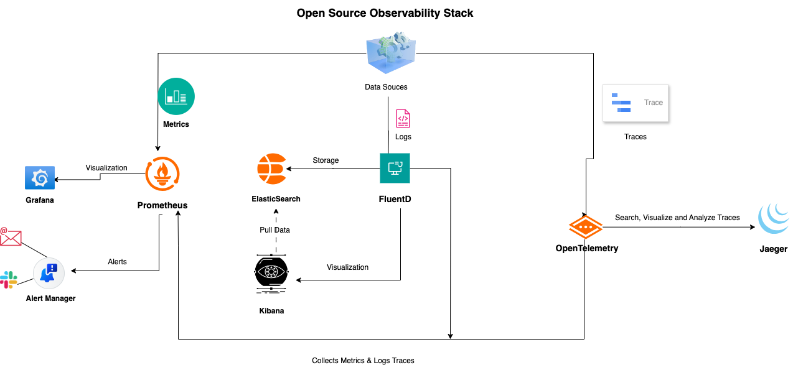

# Monitoring Stack Deployment Guide

## Table of Contents
1. [Overview](#overview)
2. [Technologies Used](#technologies-used)
3. [Architecture](#architecture)
4. [File Structure](#file-structure)
5. [Configuration Files](#configuration-files)
6. [Deployment Instructions](#deployment-instructions)
7. [Testing](#testing)

## Overview
The setup consists of four services: Node Exporter, cAdvisor, Prometheus, and Grafana. They are used for monitoring and visualizing system and container metrics.

- **Node Exporter**: Collects metrics from the host machine.
- **cAdvisor**: Collects container-level metrics from Docker containers.
- **Prometheus**: Scrapes metrics from Node Exporter and cAdvisor, stores them, and makes them available for querying.
- **Grafana**: Visualizes metrics from Prometheus through dashboards and graphs.

## Architecture



## Technologies Used
- Docker Compose
- Prometheus
- Grafana
- Node Exporter
- cAdvisor

## File Structure:
```
monitoring/
|-- agent
    |-- docker-compose.yml
    |-- .env
|-- docker-compose.yml
|-- .env
|-- prometheus-config/
  |-- prometheus.yml
```

## Configuration Files

### 1. `docker-compose.yml`
This file defines all the services for the monitoring stack and their respective configurations .

- **Node Exporter:**
  - Collects host metrics and exposes them at port `9100` for prod.
  - Uses volumes to access system metrics from the host machine.

- **cAdvisor:**
  - Monitors Docker containers and exposes metrics at port `8080` for prod.
  - Mounts Docker-related directories to access container metrics.

- **Prometheus:**
  - Central monitoring system that scrapes metrics from Node Exporter and cAdvisor.
  - Uses the `prometheus.yml` file for job definitions.

- **Grafana:**
  - Visualization tool for metrics collected by Prometheus.
  - Uses a persistent volume to store dashboard data.

**Note**: The port is different for each environment.

### 2. `prometheus.yml`
This file defines the jobs for Prometheus to scrape metrics from various sources for each environment (cAdvisor and Node Exporter).

Example configuration for each environment:
```yaml
global:
  scrape_interval: 15s

scrape_configs:
  - job_name: 'sbx-ne'
    static_configs:
      - targets: ['node-exporter:9100']
        labels:
          environment: 'sbx'

  - job_name: 'sbx-cadvisor'
    static_configs:
      - targets: ['cadvisor:8080']
        labels:
          environment: 'sbx'

  - job_name: 'dev-ne'
    static_configs:
      - targets: ['node-exporter:9100']
        labels:
          environment: 'dev'

  - job_name: 'dev-cadvisor'
    static_configs:
      - targets: ['cadvisor:8080']
        labels:
          environment: 'dev'

  - job_name: 'prd-ne'
    static_configs:
      - targets: ['node-exporter:9100']
        labels:
          environment: 'prd'

  - job_name: 'prd-cadvisor'
    static_configs:
      - targets: ['cadvisor:8080']
        labels:
          environment: 'prd'

```

### 3. `.env`
Define the required environment variables for the Docker Compose setup, including port mappings, container names and image names.

## Deployment Steps:
1. **Create Environment File:** Create a `.env` file with the required environment variables.
2. **Update `prometheus.yml`:** Ensure all jobs are defined properly in `prometheus-config/prometheus.yml`.
3. **Start the Stack:**
```bash
docker-compose up -d
```
4. **Check Prometheus UI:** Visit `http://<your-host>:9090` to verify targets are up.


5. **Check Grafana UI:** Visit `http://<your-host>:3000` and log in using the admin credentials defined in `.env`.


6. **Add Data Source in Grafana:**
   - URL: `http://<your-ip>:9090`


   - Save & Test.

7. **Import Dashboards:** Upload prebuilt dashboards from Grafana Labs.
   - cAdvisor: 193
   - Node Exporter: 1860


## Testing:
- Visit `Prometheus UI > Status > Targets` to confirm all jobs are `UP`.
- In Grafana visualize metrics for each dashboard


